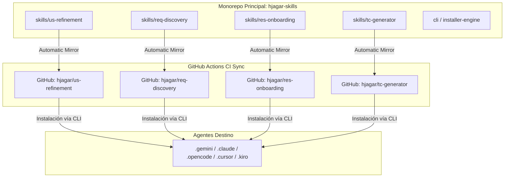

# Propuesta Arquitectónica: Monorepo `hjagar-skills` y CLI Unificado de Instalación

**Autor:** Hjagar / Gentle AI  
**Fecha:** 2026-07-22  
**Estado:** Propuesta / En revisión  
**Repositorios involucrados:** `us-refinement`, `req-discovery`, `res-onboarding`, `tc-generator`, `hjagar-skills`

---

## 1. Contexto y Problemática

Actualmente, la suite de habilidades de IA (`us-refinement`, `req-discovery`, `res-onboarding`, `tc-generator`) evoluciona en repositorios de Git independientes. Esto genera dos problemas principales de escalabilidad y mantenibilidad:

1. **Duplicación de Boilerplate de Instalación (DRY Violated):** Cada repositorio mantiene copias de los scripts de instalación/actualización/desinstalación (`install.ps1`, `install.sh`, `update.ps1`, `update.sh`, `Release-Repo.ps1`, `lib/skill-payload.*`). Cualquier cambio o mejora en la lógica de distribución requiere actualizar N repositorios manualmente.
2. **Fricción en Refactors Cruzados:** Probar o implementar cambios que afectan la interacción entre habilidades en cadena (ej: `req-discovery` -> `us-refinement` -> `tc-generator`) requiere gestionar Pull Requests y commits independientes en múltiples repositorios.

---

## 2. Visión Arquitectónica

La solución propuesta se divide en dos pilares complementarios:



---

## 3. Pilar I: Motor de Instalación Unificado (`hjagar-skill-cli`)

En lugar de que cada habilidad contenga ~500 líneas de scripts ejecutable duplicados:

1. **Estructura Declarativa del Skill:** El repositorio de cada habilidad contendrá únicamente sus activos de dominio:
   ```
   us-refinement/
   ├── SKILL.md
   ├── assets/
   ├── references/
   ├── scripts/
   └── tests/
   ```
2. **CLI / Engine Centralizado:** Un único instalador (`hjagar-skill` o script remoto en `hjagar-skills`) se encarga de:
   - Descubrir y validar la estructura de cualquier habilidad.
   - Realizar la copia atómica con staging a los directorios de agentes (`.gemini`, `.claude`, `.opencode`, `.copilot`, `.cursor`, `.agents`).
   - Generar dinámicamente los archivos de steering para Kiro (`.kiro/steering/`).
   - Ejecutar la desinstalación limpia por nombre de habilidad.

### Ventajas:
- **Cero duplicación de código de instalación.**
- Mantenimiento centralizado: agregar soporte para un nuevo agente o IA requiere modificar **un solo archivo** en el motor central.

---

## 4. Pilar II: Monorepo `hjagar-skills` con CI Sync

Desarrollo unificado bajo el repositorio `hjagar-skills` manteniendo la distribución de repositorios independientes en GitHub.

### Estructura del Monorepo:
```
hjagar-skills/
├── .github/workflows/
│   ├── sync-us-refinement.yml
│   ├── sync-req-discovery.yml
│   ├── sync-res-onboarding.yml
│   └── sync-tc-generator.yml
├── cli/
│   ├── install.ps1
│   ├── install.sh
│   └── lib/skill-payload.ps1
└── skills/
    ├── us-refinement/
    ├── req-discovery/
    ├── res-onboarding/
    └── tc-generator/
```

### Flujo de Sincronización Automática (CI Sync):
1. **Desarrollo en un solo lugar:** Los desarrolladores y agentes trabajan directamente en `hjagar-skills`. Un solo Pull Request permite refactorizar la interacción entre múltiples habilidades.
2. **Push/Merge a `main`:** Al fusionar cambios en la rama `main` de `hjagar-skills`, una GitHub Action ejecuta un `git subtree push` o `repo-sync` hacia los repositorios individuales (`hjagar/us-refinement`, `hjagar/req-discovery`, etc.).
3. **Distribución Independiente Preservada:** Cualquier usuario o herramienta externa que consuma las habilidades directamente desde `hjagar/us-refinement` no notará ningún cambio funcional ni rotura en los URLs de clonación o instalación.

---

## 5. Hoja de Ruta Sugerida (Roadmap de Implementación)

1. **Fase 1 (Actual - US-81):** Completar el refactor de arquitectura de `us-refinement` (`SKILL.md` liviano + `assets/` + `references/`).
2. **Fase 2:** Crear el repositorio `hjagar-skills` e migrar las carpetas de las 4 habilidades.
3. **Fase 3:** Extraer la lógica de instalación unificada en `cli/`.
4. **Fase 4:** Configurar las GitHub Actions de sincronización hacia repos individuales.
